

  

<h1>F4B0Y Here !</h1>

  <code>Software Developer</code>
  &nbsp;•&nbsp;
  <code>AI Builder</code>
  &nbsp;•&nbsp;
  <code>Web Developer</code>

  
  &nbsp;
  
  &nbsp;
  
  &nbsp;
  

## 👨‍💻 About Me

<table>
<tr>
<td width="68%" valign="top">

  I’m a <strong>Software Developer</strong> focused on building useful digital products across <strong>Web, Mobile, and AI</strong>.

- 🌐 **Web Development** — Building modern, scalable, and user-focused web applications.
- 📱 **Mobile Development** — Exploring mobile applications and practical cross-platform experiences.
- 🤖 **Artificial Intelligence** — Developing AI-powered systems, automation, and intelligent workflows.
- 🧠 **Software Engineering** — Interested in clean architecture, security, APIs, databases, and reliable systems.
- 🔬 **Future Focus** — Planning to expand into <strong>Quantum Computing</strong> and explore the intersection of quantum technology, AI, and software engineering.
- 🚀 **Builder Mindset** — I enjoy turning ideas into working systems, continuously learning, experimenting, and improving.
- 🎯 **Goal** — Grow from building applications today toward contributing to the next generation of intelligent and quantum-powered technology.

</td>

<td width="32%" align="center" valign="middle">

  

  <strong>Web • Mobile • AI • Quantum</strong>
   
  

</td>
</tr>
</table>

## 🧰 Languages & Tools

<strong>Languages</strong> 

<strong>Frameworks & Libraries</strong> 

<strong>Developer Tools</strong> 

<strong>Databases</strong> 

<strong>Cloud & DevOps</strong> 

<code>✨ Click a technology icon to view details</code>

 <strong>PHP</strong>

<table>
<tr>
<td width="20%" align="center" valign="middle"><strong>Level</strong>  Intermediate</td>
<td width="48%" align="center" valign="middle">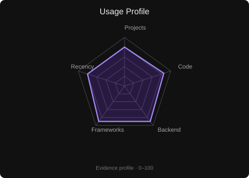</td>
<td width="32%" valign="top"><strong>Projects</strong>  • <a href="https://github.com/Fbi-Boy/madura-mart">Madura Mart</a> • <a href="https://github.com/Fbi-Boy/pt-putra-prananta-website">PT Putra Prananta</a></td>
</tr>
</table>

 <strong>Python</strong>

<table>
<tr>
<td width="20%" align="center" valign="middle"><strong>Level</strong>  Intermediate</td>
<td width="48%" align="center" valign="middle">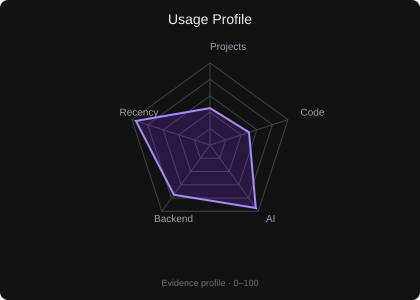</td>
<td width="32%" valign="top"><strong>Projects</strong>  • <a href="https://github.com/Fbi-Boy/universal-task-ai">Universal Task AI</a></td>
</tr>
</table>

 <strong>JavaScript</strong>

<table>
<tr>
<td width="20%" align="center" valign="middle"><strong>Level</strong>  Intermediate</td>
<td width="48%" align="center" valign="middle">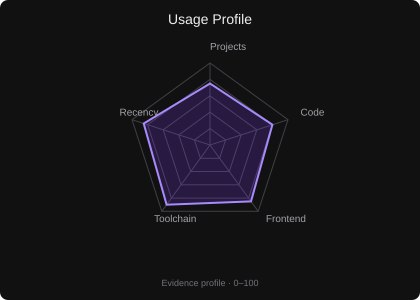</td>
<td width="32%" valign="top"><strong>Projects</strong>  • <a href="https://github.com/Fbi-Boy/pt-putra-prananta-website">PT Putra Prananta</a> • <a href="https://github.com/Fbi-Boy/madura-mart">Madura Mart</a></td>
</tr>
</table>

 <strong>Kotlin</strong>

<table>
<tr>
<td width="20%" align="center" valign="middle"><strong>Level</strong>  Intermediate</td>
<td width="48%" align="center" valign="middle">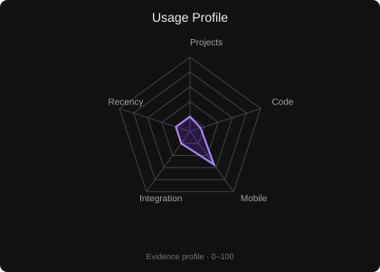</td>
<td width="32%" valign="top"><strong>Projects</strong>  • No tracked project yet</td>
</tr>
</table>

 <strong>Dart</strong>

<table>
<tr>
<td width="20%" align="center" valign="middle"><strong>Level</strong>  Intermediate</td>
<td width="48%" align="center" valign="middle">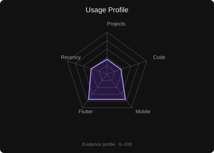</td>
<td width="32%" valign="top"><strong>Projects</strong>  • <a href="https://github.com/Fbi-Boy/latihan_flutter">latihan_flutter</a></td>
</tr>
</table>

 <strong>C++</strong>

<table>
<tr>
<td width="20%" align="center" valign="middle"><strong>Level</strong>  Intermediate</td>
<td width="48%" align="center" valign="middle">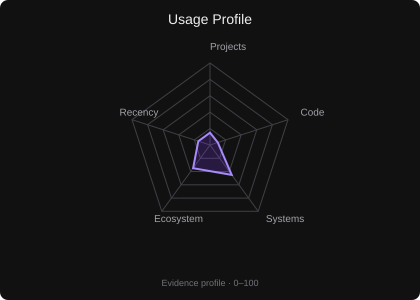</td>
<td width="32%" valign="top"><strong>Projects</strong>  • No tracked project yet</td>
</tr>
</table>

 <strong>HTML</strong>

<table>
<tr>
<td width="20%" align="center" valign="middle"><strong>Level</strong>  Intermediate</td>
<td width="48%" align="center" valign="middle">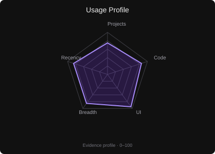</td>
<td width="32%" valign="top"><strong>Projects</strong>  • <a href="https://github.com/Fbi-Boy/pt-putra-prananta-website">PT Putra Prananta</a> • <a href="https://github.com/Fbi-Boy/madura-mart">Madura Mart</a></td>
</tr>
</table>

 <strong>CSS</strong>

<table>
<tr>
<td width="20%" align="center" valign="middle"><strong>Level</strong>  Intermediate</td>
<td width="48%" align="center" valign="middle">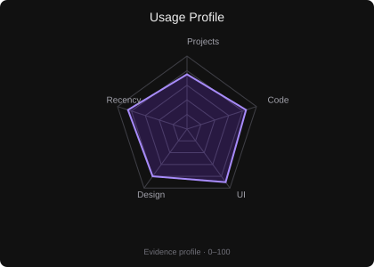</td>
<td width="32%" valign="top"><strong>Projects</strong>  • <a href="https://github.com/Fbi-Boy/pt-putra-prananta-website">PT Putra Prananta</a> • <a href="https://github.com/Fbi-Boy/madura-mart">Madura Mart</a></td>
</tr>
</table>

 <strong>Bash</strong>

<table>
<tr>
<td width="20%" align="center" valign="middle"><strong>Level</strong>  Intermediate</td>
<td width="48%" align="center" valign="middle">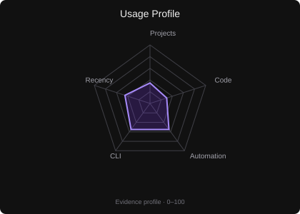</td>
<td width="32%" valign="top"><strong>Projects</strong>  • <a href="https://github.com/Fbi-Boy/universal-task-ai">Universal Task AI</a></td>
</tr>
</table>

 <strong>SQL</strong>

<table>
<tr>
<td width="20%" align="center" valign="middle"><strong>Level</strong>  Intermediate</td>
<td width="48%" align="center" valign="middle">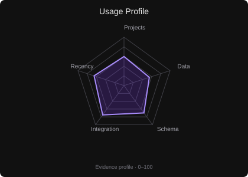</td>
<td width="32%" valign="top"><strong>Projects</strong>  • <a href="https://github.com/Fbi-Boy/madura-mart">Madura Mart</a> • <a href="https://github.com/Fbi-Boy/universal-task-ai">Universal Task AI</a></td>
</tr>
</table>

 <strong>Laravel</strong>

<table>
<tr>
<td width="20%" align="center" valign="middle"><strong>Level</strong>  Intermediate</td>
<td width="48%" align="center" valign="middle">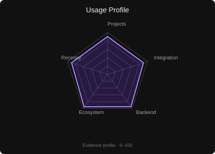</td>
<td width="32%" valign="top"><strong>Projects</strong>  • <a href="https://github.com/Fbi-Boy/madura-mart">Madura Mart</a> • <a href="https://github.com/Fbi-Boy/pt-putra-prananta-website">PT Putra Prananta</a></td>
</tr>
</table>

 <strong>CodeIgniter</strong>

<table>
<tr>
<td width="20%" align="center" valign="middle"><strong>Level</strong>  Intermediate</td>
<td width="48%" align="center" valign="middle">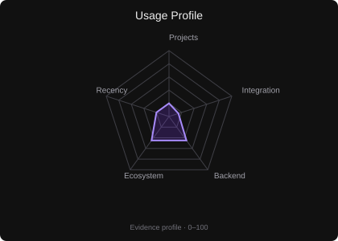</td>
<td width="32%" valign="top"><strong>Projects</strong>  • No tracked project yet</td>
</tr>
</table>

 <strong>Node.js</strong>

<table>
<tr>
<td width="20%" align="center" valign="middle"><strong>Level</strong>  Intermediate</td>
<td width="48%" align="center" valign="middle">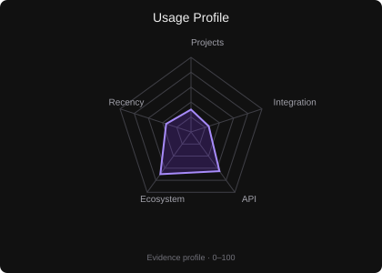</td>
<td width="32%" valign="top"><strong>Projects</strong>  • No tracked project yet</td>
</tr>
</table>

 <strong>React</strong>

<table>
<tr>
<td width="20%" align="center" valign="middle"><strong>Level</strong>  Intermediate</td>
<td width="48%" align="center" valign="middle"></td>
<td width="32%" valign="top"><strong>Projects</strong>  • No tracked project yet</td>
</tr>
</table>

 <strong>Next.js</strong>

<table>
<tr>
<td width="20%" align="center" valign="middle"><strong>Level</strong>  Intermediate</td>
<td width="48%" align="center" valign="middle"></td>
<td width="32%" valign="top"><strong>Projects</strong>  • No tracked project yet</td>
</tr>
</table>

 <strong>Tailwind CSS</strong>

<table>
<tr>
<td width="20%" align="center" valign="middle"><strong>Level</strong>  Intermediate</td>
<td width="48%" align="center" valign="middle">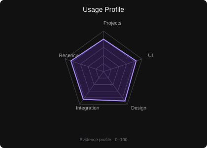</td>
<td width="32%" valign="top"><strong>Projects</strong>  • <a href="https://github.com/Fbi-Boy/pt-putra-prananta-website">PT Putra Prananta</a> • <a href="https://github.com/Fbi-Boy/madura-mart">Madura Mart</a></td>
</tr>
</table>

 <strong>Bootstrap</strong>

<table>
<tr>
<td width="20%" align="center" valign="middle"><strong>Level</strong>  Intermediate</td>
<td width="48%" align="center" valign="middle">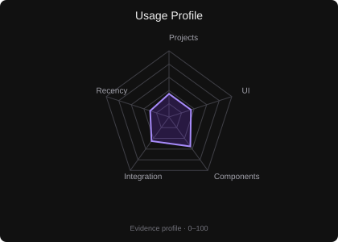</td>
<td width="32%" valign="top"><strong>Projects</strong>  • No tracked project yet</td>
</tr>
</table>

 <strong>Alpine.js</strong>

<table>
<tr>
<td width="20%" align="center" valign="middle"><strong>Level</strong>  Intermediate</td>
<td width="48%" align="center" valign="middle">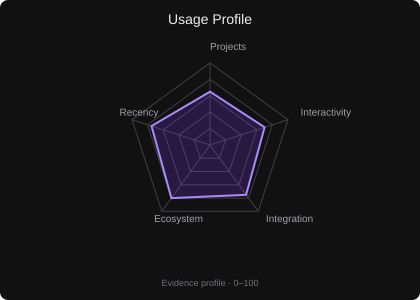</td>
<td width="32%" valign="top"><strong>Projects</strong>  • <a href="https://github.com/Fbi-Boy/pt-putra-prananta-website">PT Putra Prananta</a> • <a href="https://github.com/Fbi-Boy/madura-mart">Madura Mart</a></td>
</tr>
</table>

 <strong>Flutter</strong>

<table>
<tr>
<td width="20%" align="center" valign="middle"><strong>Level</strong>  Intermediate</td>
<td width="48%" align="center" valign="middle">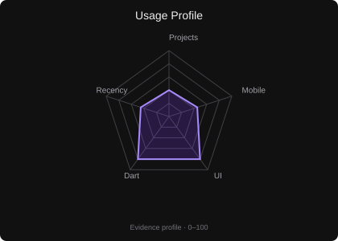</td>
<td width="32%" valign="top"><strong>Projects</strong>  • <a href="https://github.com/Fbi-Boy/latihan_flutter">latihan_flutter</a></td>
</tr>
</table>

 <strong>Git</strong>

<table>
<tr>
<td width="20%" align="center" valign="middle"><strong>Level</strong>  Intermediate</td>
<td width="48%" align="center" valign="middle">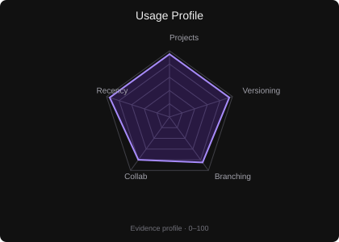</td>
<td width="32%" valign="top"><strong>Projects</strong>  • <a href="https://github.com/Fbi-Boy/universal-task-ai">Universal Task AI</a> • <a href="https://github.com/Fbi-Boy/madura-mart">Madura Mart</a> • <a href="https://github.com/Fbi-Boy/pt-putra-prananta-website">PT Putra Prananta</a></td>
</tr>
</table>

 <strong>GitHub</strong>

<table>
<tr>
<td width="20%" align="center" valign="middle"><strong>Level</strong>  Intermediate</td>
<td width="48%" align="center" valign="middle">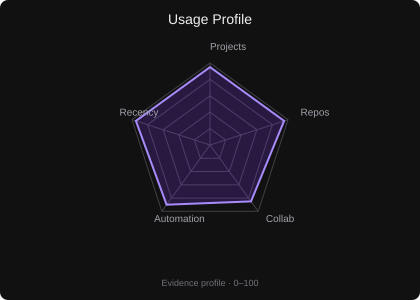</td>
<td width="32%" valign="top"><strong>Projects</strong>  • <a href="https://github.com/Fbi-Boy/universal-task-ai">Universal Task AI</a> • <a href="https://github.com/Fbi-Boy/madura-mart">Madura Mart</a> • <a href="https://github.com/Fbi-Boy/pt-putra-prananta-website">PT Putra Prananta</a></td>
</tr>
</table>

 <strong>VS Code</strong>

<table>
<tr>
<td width="20%" align="center" valign="middle"><strong>Level</strong>  Intermediate</td>
<td width="48%" align="center" valign="middle">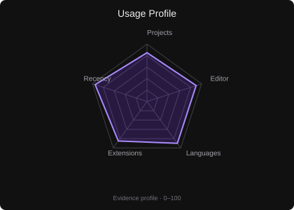</td>
<td width="32%" valign="top"><strong>Projects</strong>  • <a href="https://github.com/Fbi-Boy/universal-task-ai">Universal Task AI</a> • <a href="https://github.com/Fbi-Boy/madura-mart">Madura Mart</a> • <a href="https://github.com/Fbi-Boy/pt-putra-prananta-website">PT Putra Prananta</a></td>
</tr>
</table>

 <strong>PhpStorm</strong>

<table>
<tr>
<td width="20%" align="center" valign="middle"><strong>Level</strong>  Intermediate</td>
<td width="48%" align="center" valign="middle">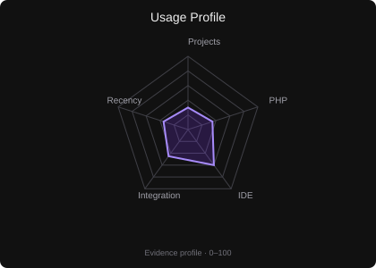</td>
<td width="32%" valign="top"><strong>Projects</strong>  • <a href="https://github.com/Fbi-Boy/madura-mart">Madura Mart</a> • <a href="https://github.com/Fbi-Boy/pt-putra-prananta-website">PT Putra Prananta</a></td>
</tr>
</table>

 <strong>PyCharm</strong>

<table>
<tr>
<td width="20%" align="center" valign="middle"><strong>Level</strong>  Intermediate</td>
<td width="48%" align="center" valign="middle">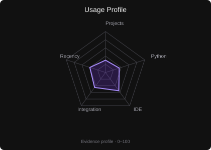</td>
<td width="32%" valign="top"><strong>Projects</strong>  • <a href="https://github.com/Fbi-Boy/universal-task-ai">Universal Task AI</a></td>
</tr>
</table>

 <strong>Docker</strong>

<table>
<tr>
<td width="20%" align="center" valign="middle"><strong>Level</strong>  Intermediate</td>
<td width="48%" align="center" valign="middle">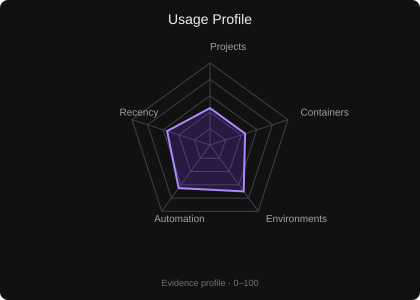</td>
<td width="32%" valign="top"><strong>Projects</strong>  • <a href="https://github.com/Fbi-Boy/universal-task-ai">Universal Task AI</a></td>
</tr>
</table>

 <strong>Linux</strong>

<table>
<tr>
<td width="20%" align="center" valign="middle"><strong>Level</strong>  Intermediate</td>
<td width="48%" align="center" valign="middle">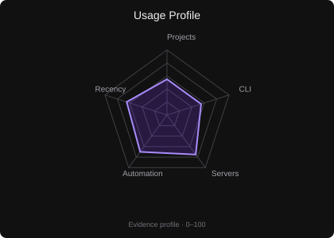</td>
<td width="32%" valign="top"><strong>Projects</strong>  • <a href="https://github.com/Fbi-Boy/universal-task-ai">Universal Task AI</a></td>
</tr>
</table>

 <strong>Postman</strong>

<table>
<tr>
<td width="20%" align="center" valign="middle"><strong>Level</strong>  Intermediate</td>
<td width="48%" align="center" valign="middle">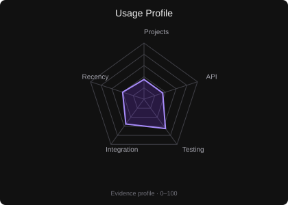</td>
<td width="32%" valign="top"><strong>Projects</strong>  • No tracked project yet</td>
</tr>
</table>

 <strong>npm</strong>

<table>
<tr>
<td width="20%" align="center" valign="middle"><strong>Level</strong>  Intermediate</td>
<td width="48%" align="center" valign="middle">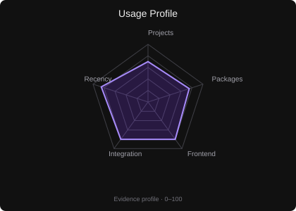</td>
<td width="32%" valign="top"><strong>Projects</strong>  • <a href="https://github.com/Fbi-Boy/pt-putra-prananta-website">PT Putra Prananta</a> • <a href="https://github.com/Fbi-Boy/madura-mart">Madura Mart</a></td>
</tr>
</table>

 <strong>pnpm</strong>

<table>
<tr>
<td width="20%" align="center" valign="middle"><strong>Level</strong>  Intermediate</td>
<td width="48%" align="center" valign="middle">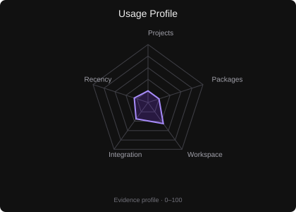</td>
<td width="32%" valign="top"><strong>Projects</strong>  • No tracked project yet</td>
</tr>
</table>

 <strong>Vite</strong>

<table>
<tr>
<td width="20%" align="center" valign="middle"><strong>Level</strong>  Intermediate</td>
<td width="48%" align="center" valign="middle">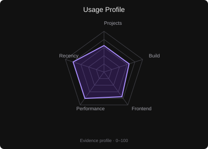</td>
<td width="32%" valign="top"><strong>Projects</strong>  • <a href="https://github.com/Fbi-Boy/pt-putra-prananta-website">PT Putra Prananta</a> • <a href="https://github.com/Fbi-Boy/madura-mart">Madura Mart</a></td>
</tr>
</table>

 <strong>Figma</strong>

<table>
<tr>
<td width="20%" align="center" valign="middle"><strong>Level</strong>  Intermediate</td>
<td width="48%" align="center" valign="middle">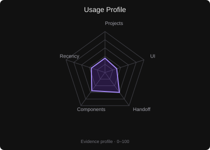</td>
<td width="32%" valign="top"><strong>Projects</strong>  • No tracked repository project yet</td>
</tr>
</table>

 <strong>MySQL</strong>

<table>
<tr>
<td width="20%" align="center" valign="middle"><strong>Level</strong>  Intermediate</td>
<td width="48%" align="center" valign="middle">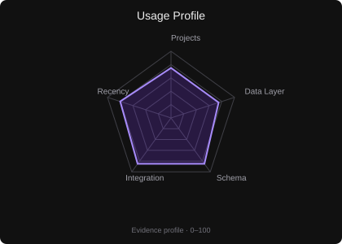</td>
<td width="32%" valign="top"><strong>Projects</strong>  • <a href="https://github.com/Fbi-Boy/madura-mart">Madura Mart</a> • <a href="https://github.com/Fbi-Boy/pt-putra-prananta-website">PT Putra Prananta</a></td>
</tr>
</table>

 <strong>PostgreSQL</strong>

<table>
<tr>
<td width="20%" align="center" valign="middle"><strong>Level</strong>  Intermediate</td>
<td width="48%" align="center" valign="middle">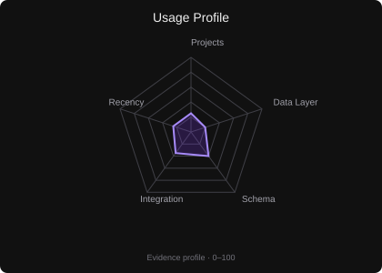</td>
<td width="32%" valign="top"><strong>Projects</strong>  • No tracked project yet</td>
</tr>
</table>

 <strong>SQLite</strong>

<table>
<tr>
<td width="20%" align="center" valign="middle"><strong>Level</strong>  Intermediate</td>
<td width="48%" align="center" valign="middle">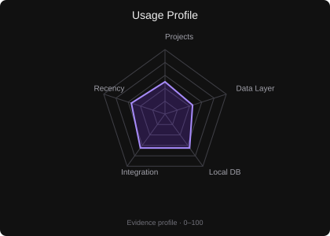</td>
<td width="32%" valign="top"><strong>Projects</strong>  • <a href="https://github.com/Fbi-Boy/madura-mart">Madura Mart</a> • <a href="https://github.com/Fbi-Boy/latihan_flutter">latihan_flutter</a></td>
</tr>
</table>

 <strong>MongoDB</strong>

<table>
<tr>
<td width="20%" align="center" valign="middle"><strong>Level</strong>  Intermediate</td>
<td width="48%" align="center" valign="middle">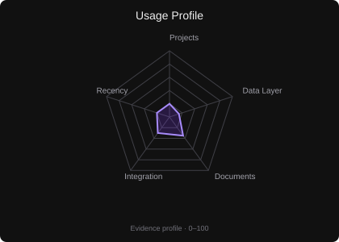</td>
<td width="32%" valign="top"><strong>Projects</strong>  • No tracked project yet</td>
</tr>
</table>

 <strong>Redis</strong>

<table>
<tr>
<td width="20%" align="center" valign="middle"><strong>Level</strong>  Intermediate</td>
<td width="48%" align="center" valign="middle">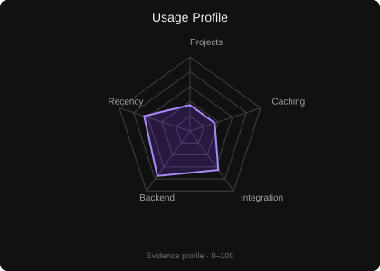</td>
<td width="32%" valign="top"><strong>Projects</strong>  • <a href="https://github.com/Fbi-Boy/universal-task-ai">Universal Task AI</a></td>
</tr>
</table>

 <strong>Firebase</strong>

<table>
<tr>
<td width="20%" align="center" valign="middle"><strong>Level</strong>  Intermediate</td>
<td width="48%" align="center" valign="middle">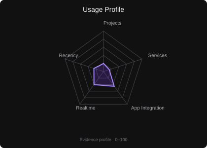</td>
<td width="32%" valign="top"><strong>Projects</strong>  • No tracked project yet</td>
</tr>
</table>

 <strong>Supabase</strong>

<table>
<tr>
<td width="20%" align="center" valign="middle"><strong>Level</strong>  Intermediate</td>
<td width="48%" align="center" valign="middle">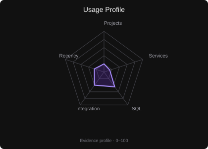</td>
<td width="32%" valign="top"><strong>Projects</strong>  • No tracked project yet</td>
</tr>
</table>

 <strong>GitHub Actions</strong>

<table>
<tr>
<td width="20%" align="center" valign="middle"><strong>Level</strong>  Intermediate</td>
<td width="48%" align="center" valign="middle">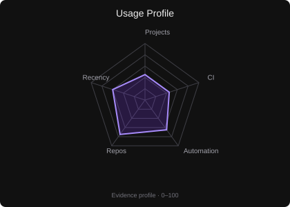</td>
<td width="32%" valign="top"><strong>Projects</strong>  • <a href="https://github.com/Fbi-Boy/universal-task-ai">Universal Task AI</a></td>
</tr>
</table>

 <strong>Nginx</strong>

<table>
<tr>
<td width="20%" align="center" valign="middle"><strong>Level</strong>  Intermediate</td>
<td width="48%" align="center" valign="middle">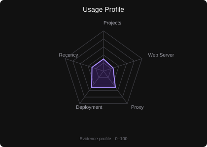</td>
<td width="32%" valign="top"><strong>Projects</strong>  • No tracked project yet</td>
</tr>
</table>

 <strong>Vercel</strong>

<table>
<tr>
<td width="20%" align="center" valign="middle"><strong>Level</strong>  Intermediate</td>
<td width="48%" align="center" valign="middle">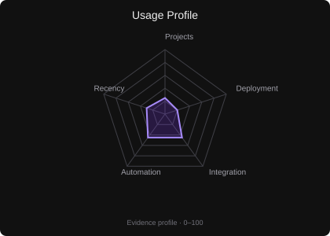</td>
<td width="32%" valign="top"><strong>Projects</strong>  • No tracked project yet</td>
</tr>
</table>

 <strong>AWS</strong>

<table>
<tr>
<td width="20%" align="center" valign="middle"><strong>Level</strong>  Intermediate</td>
<td width="48%" align="center" valign="middle">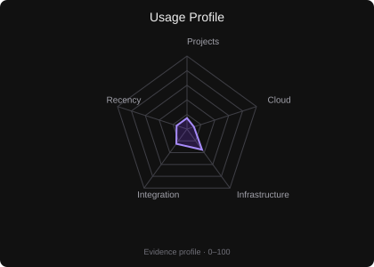</td>
<td width="32%" valign="top"><strong>Projects</strong>  • No tracked project yet</td>
</tr>
</table>

 <strong>Cloudflare</strong>

<table>
<tr>
<td width="20%" align="center" valign="middle"><strong>Level</strong>  Intermediate</td>
<td width="48%" align="center" valign="middle">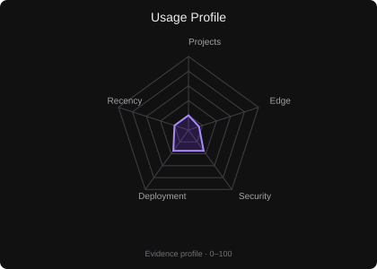</td>
<td width="32%" valign="top"><strong>Projects</strong>  • No tracked project yet</td>
</tr>
</table>

The radar is a vector chart; its dimensions are adapted to the selected technology type.

---

## 📊 GitHub Analytics

&nbsp;

  

---

## 📈 Contribution Activity

  

---

## 🏗️ Tech Stack

---

## ⭐ Selected Work

<table>
<tr>

<td width="33%" valign="top">

### 🤖 Universal Task AI

Secure, modular hybrid AI assistant designed to plan, execute, review, and deliver complex tasks across local and browser environments.

**Focus**
- AI orchestration
- Automation
- Security
- Execution pipelines

<a href="https://github.com/Fbi-Boy/universal-task-ai">View repository →</a>

</td>

<td width="33%" valign="top">

### 🛒 Madura Mart

Laravel-based retail management system with role-aware workflows and operational modules.

**Includes**
- POS / Kasir
- Gudang
- Kurir
- Purchasing
- Reports
- Administration

<a href="https://github.com/Fbi-Boy/madura-mart">View repository →</a>

</td>

<td width="33%" valign="top">

### 🏢 PT Putra Prananta

Modern Laravel website built around a clean frontend workflow.

**Stack**
- Laravel
- Tailwind CSS
- Alpine.js
- Vite
- Lucide

<a href="https://github.com/Fbi-Boy/pt-putra-prananta-website">View repository →</a>

</td>

</tr>
</table>

---

## 💬 Developer Notes

<blockquote>
<strong>“Build things that are useful. Make them reliable. Then make them better.”</strong>
</blockquote>

  

---

 

<strong>Fbi-Boy</strong> · Software Developer • AI Builder • Web Developer

